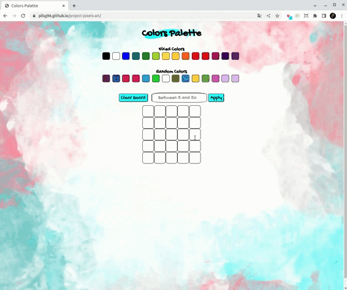
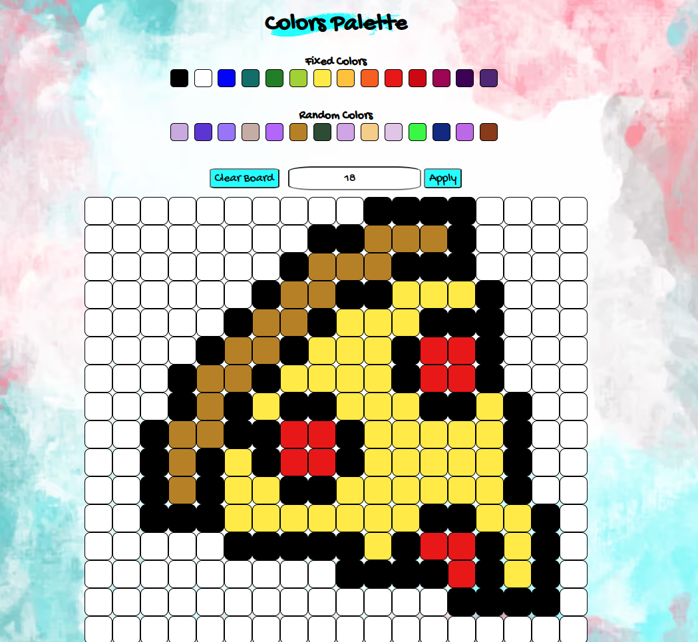

<h1 align="center"><b>
  Projeto Pixels Art
</b></h1>

## Descrição

  

    Projeto realizado com objetivo de construir uma página para usar sua imaginação e pixels =)
  

## Tecnologias e técnicas utilizadas

  <ul>
    <li>Html</li>
    <li>Css</li>
    <li>Javascript</li>
  </ul>

## Deploy

https://pllsg96.github.io/project-pixels-art/

## Exemplos

  

  

# :construction: README customizado em construção ! :construction: